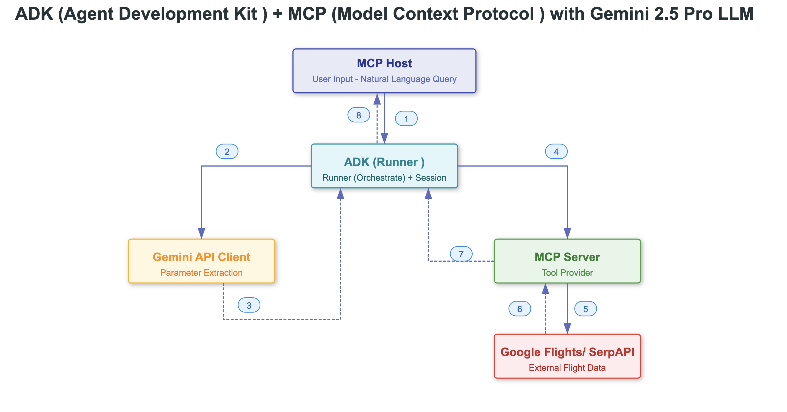

# Python ADK as MCP Client using Gemini 2 LLM as flight search assistant

Python ADK + MCP Gemini

A practical implementation demonstrating ADK (Agent Development Kit) as an MCP (Model Context Protocol) client for flight search capabilities. This project showcases asynchronous integration between ADK's LlmAgent and an external MCP server, featuring dynamic tool discovery, stateful session management, and structured function calling. Powered by Google's Gemini model, it implements proper resource handling and event-driven architecture for a robust, extensible assistant.

## 📚 Table of Contents

* [Introduction to ADK and MCP](#-introduction-to-adk-and-mcp)
* [Architecture](#-architecture)
  * [Core Components](#-core-components)
  * [Technology Highlights](#-technology-highlights)
* [Features](#-features)
* [Core Concepts](#-core-concepts)
  * [ADK - Agent Development Kit](#adk---agent-development-kit)
  * [Agents in ADK](#agents-in-adk)
  * [Tools in ADK](#tools-in-adk)
  * [MCP Client Integration](#mcp-client-integration)
* [Implementation Steps](#-implementation-steps)
  * [Prerequisites](#prerequisites)
  * [Step 1: Setup Environment](#step-1-setup-environment)
  * [Step 2: Install MCP Server](#step-2-install-mcp-server)
  * [Step 3: Connecting to MCP Server](#step-3-connecting-to-mcp-server)
  * [Step 4: Agent Creation](#step-4-agent-creation)
  * [Step 5: Integration and Session Management](#step-5-integration-and-session-management)
  * [Step 6: Execution](#step-6-execution)
  * [Step 7: Demo](#step-7-demo)
* [Getting Started Guide](#-getting-started-guide)
  * [Installation Steps](#installation-steps)
  * [Environment Setup](#environment-setup)
  * [Configuration](#configuration)
  * [Start Services](#start-services)
* [Project Structure](#-project-structure)
* [Key Considerations for Integration](#-key-considerations-for-integration)
* [Troubleshooting](#-troubleshooting)
* [Official Documentation References](#-official-documentation-references)
* [Repository](#-repository)
* [Author](#-author)

## 🔍 Introduction to ADK and MCP

This project showcases the integration of two powerful Google technologies:
- **Agent Development Kit (ADK)**: An open-source, code-first Python toolkit for building intelligent AI agents
- **Model Context Protocol (MCP)**: A standardized protocol for AI models to interact with external tools

In this implementation, ADK acts as the MCP Client, connecting to an MCP Server that provides flight search capabilities.

## 🏗️ Architecture

The Flight Search Assistant follows a streamlined request flow that combines the power of Google Gemini, ADK, and MCP to process user queries and provide intelligent responses.



### 🧩 Core Components 

- **Google Gemini 2 as LLM**
- **Agent Development Kit (ADK) as Agent**
- **Model Context Protocol (MCP)**
- **SerpAPI for Search**
- **Python 3.8+**

### ✨ Technology Highlights

* **Google Gemini 2**  
Powers conversational AI and context-aware interactions.
* **Agent Development Kit (ADK)**  
Manages conversation flow and tool orchestration.
* **Model Context Protocol (MCP)**  
Handles secure tool operations and external API calls.
* **SerpAPI**  
Provides access to real-time flight data.

## 🚀 Features

* **ADK as MCP Client Integration** - Seamless connection between ADK agent and MCP server using `MCPToolset`
* **Dynamic Tool Discovery** - Automatic detection and integration of MCP server capabilities
* **Asynchronous Event Processing** - Event-driven architecture with ADK's Runner for non-blocking operations
* **Stateful Sessions** - Conversation context management with `InMemorySessionService`
* **Structured Tool Invocation** - Type-safe function calling through MCP protocol
* **Clean Resource Management** - Proper connection lifecycle handling with exit stacks

## 🧠 Core Concepts

### ADK - Agent Development Kit

**Agent Development Kit (ADK)** is an open-source, code-first Python toolkit for building, evaluating, and deploying intelligent AI agents. ADK enables developers to create agentic workflows — from simple single-agent tasks to complex multi-agent orchestration — all within a modular and extensible framework.

### Agents in ADK

An **Agent** is an autonomous, self-contained execution unit designed to achieve specific goals. Agents can:
1. Perform tasks
2. Interact with users
3. Leverage external tools
4. Collaborate with other agents to complete complex workflows

#### Core Agent Categories

ADK offers three primary agent types:

* **LLM Agents** (e.g., LlmAgent, Agent):
  * Use LLMs to understand, reason, plan, and act
  * Ideal for dynamic, language-driven tasks

* **Workflow Agents** (e.g., SequentialAgent, ParallelAgent, LoopAgent):
  * Orchestrate other agents in predictable patterns
  * Don't rely on an LLM for flow control
  * Best for structured, repeatable processes

* **Custom Agents**:
  * Built by extending BaseAgent
  * Enable custom logic, specialized workflows, or unique tool integrations
  * Perfect for advanced, tailor-made solutions

In this project, we're using **LLM Agents** with **MCPTools**.

### Tools in ADK

A **Tool** represents a specific capability granted to an AI agent, allowing it to perform actions and interact with the external world beyond basic text generation and reasoning. A tool is usually a modular code component — such as a Python function, class method, or even another agent — designed to carry out a defined task.

#### How Agents Use Tools

Agents dynamically leverage tools through **function-calling mechanisms**, where the LLM:
1. Reasons over context
2. Selects and invokes the appropriate tool with generated inputs
3. Observes the result
4. Integrates the output into its next action or response

#### Tool Types in ADK

ADK supports several types of tools:

1. **Function Tools**: Custom tools built specifically for your application's unique logic
   * **Functions/Methods**: Standard synchronous Python functions or class methods
   * **Agents-as-Tools**: Specialized agents as callable tools within a parent agent
   * **Long-Running Function Tools**: Tools for asynchronous or time-intensive operations

2. **Built-in Tools**: Predefined tools included in the framework (web search, code execution, RAG)

3. **Third-Party Tools**: Integrations from popular ecosystems like LangChain or CrewAI

### MCP Client Integration

In this project, ADK serves as an MCP Client that connects to an MCP Server (`mcp-flight-search`). This connection allows the ADK agent to discover and use tools exposed by the MCP server to search for flights.

## 🛠️ Implementation Steps

### Prerequisites

1. **Python 3.8+** installed
2. Google **Gemini** Generative AI access via API key
3. A valid **SerpAPI key** (used to fetch live flight data)

### Step 1: Setup Environment

```bash
# Setup virtual environment (Mac or Unix)
python -m venv venv
source venv/bin/activate  # On Windows: venv\Scripts\activate

# Install dependencies
pip install google-adk  # Agent Development Kit
pip install mcp-flight-search  # MCP server 
pip install google-generativeai python-dotenv  # GenAI Python SDK
```

**Set Environment variables:**
```bash
# Note: ADK uses GOOGLE_API_KEY instead of GEMINI_API_KEY
export GOOGLE_API_KEY="your-google-api-key"
export SERP_API_KEY="your-serpapi-key"
```

### Step 2: Install MCP Server

To enable Gemini to interact with real-world APIs, we use an MCP-compliant server. For this project, we use **mcp-flight-search** — a lightweight MCP Server built using FastMCP which exposes a tool that searches real-time flight data using SerpAPI.

Verify that the MCP server is properly installed:
```bash
pip show mcp-flight-search
```

### Step 3: Connecting to MCP Server

```python
# --- Step 1: Get tools from MCP server ---
async def get_tools_async():
    """Gets tools from the Flight Search MCP Server."""
    print("Attempting to connect to MCP Flight Search server...")
    server_params = StdioServerParameters(
        command="mcp-flight-search",
        args=["--connection_type", "stdio"],
        env={"SERP_API_KEY": os.getenv("SERP_API_KEY")},
    )
    
    tools, exit_stack = await MCPToolset.from_server(
        connection_params=server_params
    )
    print("MCP Toolset created successfully.")
    return tools, exit_stack
```

### Step 4: Agent Creation

```python
# --- Step 2: Define ADK Agent Creation ---
async def get_agent_async():
    """Creates an ADK Agent equipped with tools from the MCP Server."""
    tools, exit_stack = await get_tools_async()
    print(f"Fetched {len(tools)} tools from MCP server.")
    
    # Create the LlmAgent
    root_agent = LlmAgent(
        model=os.getenv("GEMINI_MODEL", "gemini-2.5-pro-preview-03-25"),
        name='flight_search_assistant',
        instruction='Help user to search for flights using available tools based on prompt. If return date not specified, use an empty string for one-way trips.',
        tools=tools,
    )
    
    return root_agent, exit_stack
```

### Step 5: Integration and Session Management

```python
async def async_main():
    # Create services
    session_service = InMemorySessionService()
  
    # Create a session
    session = session_service.create_session(
        state={}, app_name='flight_search_app', user_id='user_flights'
    )
  
    # Define the user prompt
    query = "Find flights from Atlanta to Las Vegas 2025-05-05"
    print(f"User Query: '{query}'")
    
    # Format input as types.Content
    content = types.Content(role='user', parts=[types.Part(text=query)])
  
    # Get agent and exit_stack
    root_agent, exit_stack = await get_agent_async()
  
    # Create Runner
    runner = Runner(
        app_name='flight_search_app',
        agent=root_agent,
        session_service=session_service,
    )
```

### Step 6: Execution

```python
    print("Running agent...")
    events_async = runner.run_async(
        session_id=session.id,
        user_id=session.user_id,
        new_message=content
    )
  
    # Process events
    async for event in events_async:
        print(f"Event received: {event}")
  
    # Always clean up resources
    print("Closing MCP server connection...")
    await exit_stack.aclose()
    print("Cleanup complete.")
```

### Step 7: Demo

Example user query:
```
"Find flights from Atlanta to Las Vegas 2025-05-05"
```

Here's a demonstration of the flight search assistant in action:

#### Standard Logging Mode


#### Debug Mode


## 🚦 Getting Started Guide

### Installation Steps

#### 1. **Clone Repository**

```bash
git clone https://github.com/arjunprabhulal/adk-python-mcp-client.git
cd adk-python-mcp-client
```

#### 2. **Environment Setup**

Set up a Python virtual environment and install dependencies:

```bash
# Setup virtual environment (Mac or Unix)
python -m venv venv
source venv/bin/activate  # On Windows: venv\Scripts\activate

# Install all dependencies from requirements.txt
pip install -r requirements.txt
```

#### 3. **Configuration**

Create and configure your environment variables:

```bash
# Copy the example environment file
cp .env.example .env

# Edit the .env file with your actual API keys
# Replace placeholders with your actual keys:
# GOOGLE_API_KEY=your-actual-google-api-key
# SERP_API_KEY=your-actual-serpapi-key
```

#### 4. **Start Services**

Run the client script to start the application:

```bash
python client.py
```

The application will:
1. Connect to the MCP Flight Search server
2. Initialize the ADK agent with your Gemini API key
3. Process the default flight query or your custom query
4. Display the conversation events and final results

## 📁 Project Structure

```
adk-python-mcp-client/
├── Images/
│   ├── adk-mcp-client-log.gif      # Standard logging demo animation
│   ├── adk-mcp-client-debug.gif    # Debug mode demo animation
│   └── image.png                   # Architecture diagram
├── client.py                       # ADK client implementation
├── README.md                       # Project documentation
├── requirements.txt                # Dependencies
├── .env.example                    # Environment variables template
└── .env                            # Environment variables (not tracked by Git)
```

## 🔄 Key Considerations for Integration

1. **MCP vs. ADK**
   * **MCP** is an open protocol that standardizes how AI models interact with external tools and data sources
   * **ADK** is a Python-based framework for building and deploying AI agents
   * **MCPToolset** bridges MCP and ADK by enabling ADK agents to consume tools exposed by MCP servers

2. **Tool Types and Integration**
   * **ADK Tools**: Python objects designed for direct use within ADK agents
   * **MCP Tools**: Capabilities exposed by MCP servers, adapted by MCPToolset for use within ADK agents
   * **Third-Party Tools**: Libraries like LangChain and CrewAI offer tools that can be integrated

3. **Asynchronous Architecture**
   * Both ADK and the MCP Python library are built on Python's asyncio framework
   * Tool implementations and server handlers should be asynchronous (async def) to ensure non-blocking operations

4. **Stateful Sessions in MCP**
   * MCP establishes persistent, stateful connections between clients and servers
   * This statefulness allows for context retention across interactions but requires careful session management

5. **Deployment Considerations**
   * The persistent nature of MCP connections can pose challenges for scaling and deployment
   * Infrastructure considerations include load balancing and session affinity

6. **Managing MCP Connections in ADK**
   * MCPToolset manages the lifecycle of MCP connections within ADK
   * Using an exit_stack ensures connections are properly terminated when execution completes

## ⚠️ Troubleshooting

1. **API Key Issues**: 
   - ADK expects `GOOGLE_API_KEY` instead of `GEMINI_API_KEY`
   - If you encounter `ValueError: Missing key inputs argument!`, check that you're using the correct environment variable
   - Error message: `ValueError: Missing key inputs argument! To use the Google AI API, provide (api_key) arguments. To use the Google Cloud API, provide (vertexai, project & location) arguments.`

2. **Rate Limiting**:
   - You may encounter 429 rate-limit errors: `google.genai.errors.ClientError: 429 RESOURCE_EXHAUSTED`
   - Consider implementing retries with exponential backoff

3. **MCP Connection Issues**:
   - Ensure the MCP server is properly installed and accessible
   - Check that your SerpAPI key is correctly configured

4. **Internal Server Errors**:
   - You may occasionally see 500 internal server errors from the Gemini API
   - These can often be resolved by retrying the request after a short delay

## 📚 Official Documentation References

For more detailed information about ADK and MCP, refer to the official documentation:

- [Agent Development Kit (ADK) Documentation](https://google.github.io/adk-docs/) - Complete guide to the open-source AI agent framework integrated with Gemini and Google.
  
- [LLM Agents in ADK](https://google.github.io/adk-docs/agents/llm-agents/) - Detailed documentation on implementing LLM Agents, including defining identity, instructions, tools, and advanced configuration.
  
- [MCP Tools with ADK](https://google.github.io/adk-docs/tools/mcp-tools/#1-using-mcp-servers-with-adk-agents-adk-as-an-mcp-client) - Specific guidance on using ADK as an MCP client to connect to MCP servers.

## 📦 Repository

This project is available on GitHub at [arjunprabhulal/adk-python-mcp-client](https://github.com/arjunprabhulal/adk-python-mcp-client).

## 👨‍💻 Author

Created by Arjun Prabhulal. For more articles on AI/ML and Generative AI, follow [Arjun Prabhulal](https://arjun-prabhulal.medium.com/) on Medium.
